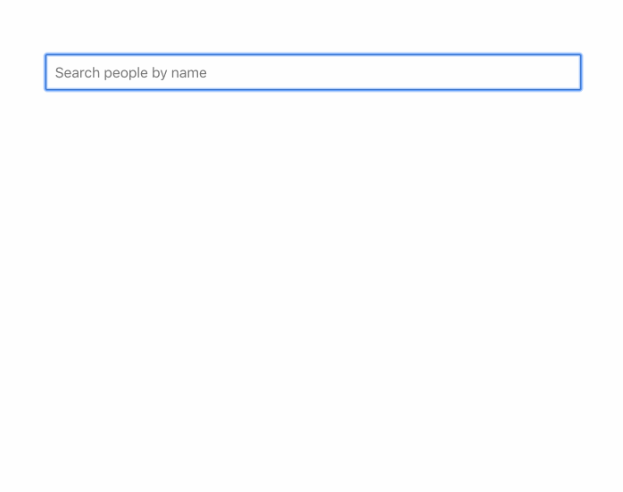

# Stimulus Search

This is a search autocomplete example created with [Stimulus](https://stimulusjs.org/) and Rails 7.



## Installation

Clone the repository:

```
git clone git@github.com:mrhead/stimulus-search.git
```

Setup the application:

```
cd stimulus-search
./bin/setup
```

Start the webserver and esbuild watch process:

```
./bin/dev
```

Go to http://localhost:3000/.

## Testing

Run:

```
rails javascript:build
rails test
rails test:system
```
